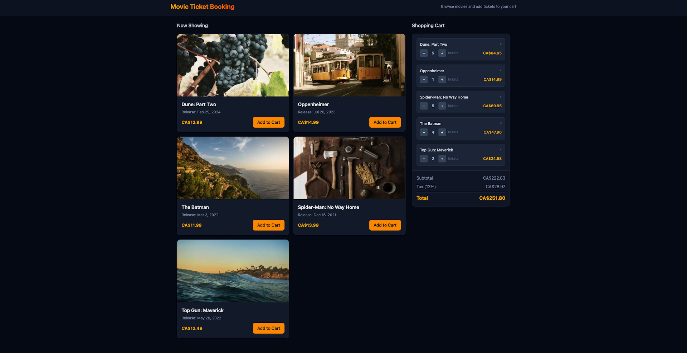

# Movie Ticket Booking — Micro-Frontend Demo

A modular Angular application demonstrating **Native Federation** for building micro-frontends. Users can browse movies and manage their ticket shopping cart in a single, cohesive experience.



## Overview

This project showcases a micro-frontend architecture where three independent Angular applications work together at runtime:

- **ticket-booking-shell** — Host application that provides the layout (header, 70/30 split) and coordinates the remotes
- **movie-catelog** — Remote micro-frontend displaying the movie catalog with thumbnails, release dates, and prices
- **shopping-cart** — Remote micro-frontend for the cart with quantity controls, subtotal, tax (13%), and total

The shell owns the cart state and communicates with both remotes via callbacks, enabling adds, updates, and removals from the cart.

## Features

- **Browse movies** — Grid of movie cards with thumbnails, titles, release dates, and ticket prices
- **Add to cart** — Add tickets from the movie catalog; updates reflect in the shopping cart
- **Manage cart** — Adjust quantities or remove items; subtotal, tax, and total update automatically
- **Standalone development** — Each remote can be developed and tested independently with mock data

## Tech Stack

- **Angular 21** with standalone components
- **Native Federation** (`@angular-architects/native-federation`) for module federation
- **Tailwind CSS** for styling (shared across all apps)

## Project Structure

```
module-federation/
├── ticket-booking-shell/    # Host (port 4200)
├── movie-catelog/           # Remote — movie list (port 4201)
├── shopping-cart/           # Remote — shopping cart (port 4202)
├── shared/                  # Shared assets and types
└── README.md
```

## Getting Started

### Prerequisites

- Node.js 18+ (LTS recommended)
- npm

### Run the full application

Start all three apps (remotes first, then the shell):

```bash
# Terminal 1 — Movie catalog
cd movie-catelog && ng serve

# Terminal 2 — Shopping cart
cd shopping-cart && ng serve

# Terminal 3 — Shell (host)
cd ticket-booking-shell && ng serve
```

Open [http://localhost:4200](http://localhost:4200) to view the consolidated application.

### Run remotes standalone

Each remote can be run independently for development:

```bash
# Movie catalog only (mock addToCart logs to console)
cd movie-catelog && ng serve
# → http://localhost:4201

# Shopping cart only (mock cart with sample data)
cd shopping-cart && ng serve
# → http://localhost:4202
```

## Documentation

See [MODULE_FEDERATION_GUIDE.md](MODULE_FEDERATION_GUIDE.md) for a detailed setup and integration guide.

## License

MIT
